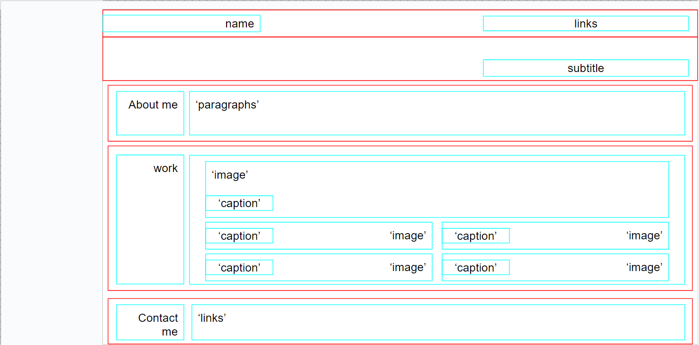

# Challenge-2-About-Me

A Webpage used for the retainment of my progress through my coding journey.

##WireFrame

##Description

I created a webpage that will later down the line be used to store all progress of my coding journey. I used html and css to devolop this webpage, and this allowed me to learn some advanced ways of css properties. Such properties include @media elements and CSS methods.

##Installation

https://github.com/B-R-Ls/Challenge-2-About-Me

##Usage

Current use is sparce, but currently links will certain links will take you sections of the page and or url to related information.

Credits

N/A

License

MIT License